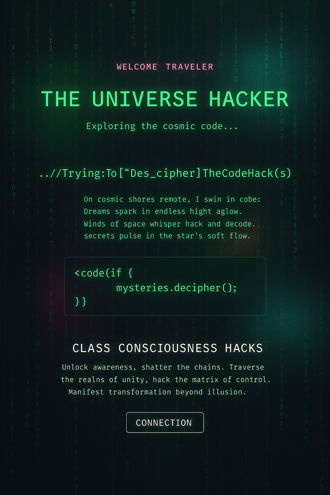

# Portal - TheUniverseHacker Main chambers

Welcome to "The Universe Hacker" - Main Sitio Web

"The Universe Hacker" - Website

Universe Hacker
Welcome, Traveler, again to the Universe Hacker Guthibe/Guildo 

 ---
Table of Contents
---
   -About the Project 
   -The Story
   -Guild VR
   -Projects
   -Manifesto
   -Getting Started 
   -How to Contribute
   -Links

---
About the Project
---
The Universe Hacker is a narrative-driven " ", where players join the Guild/—a secret society of reality hackers decoding the universe’s source code. Explore, solve , and uncover cosmic secrets. The project combines programming, philosophy, and storytelling(with VR support planned).
Genre: Sci-fi Adventure / Puzzle
Engine: 
Platforms: PC, VR (future)
Status: Early Development

---
The Story
---
Bienvenido al Centro de Comando del Gremio / Github, the hub for universe hackers. 
Here, we share cosmic secrets, build hacking tools, and decipher the ancient’s deepest secrets.
01001000 ∞ ∂/∂t λ./guild_access
'''
We'll try to unite those who love beyond love <3
class UniverseHackerVRGuild:
    def __init__(self):
        self.members = []
        self.projects = ["" ""]
        self.access_level = "UNIVERSE_HACKER"
    
    def join_guild(self, hacker):
        if hacker.can_see_matrix():
            self.members.append(hacker)
            return "ACCESS_GRANTED"
        return "REALITY_CHECK_FAILED"

'''

---
Project Description
---

   🌌 Exploits
       (Los tipicos Hacks de vida virales?)
   ⚡ Hacking Consciousness Tools
       Plantillas.
   📜 Cosmic Index
       Document the universe’s source code.

---
Manifesto
---
∫∞ git commit -m "reality"
Terminal
Access the Guild Terminal to explore repositories and collaborate. 
(Note: This is a mockup; an in-game terminal is planned for integration on the main Website.)
> ssh [email protected]
> Password: ************
> 
> ═══════════════════════════════════════
>  UNIVERSE HACKER VR GUILD - TERMINAL 
> ═══════════════════════════════════════
> 
> Available repositories:
> - exploits/     [ACTIVE DEVELOPMENT]
> - ConsciousnessHacking-tools/        [BETA TESTING]
> - cosmic-index/         [DOCUMENTATION]
> - guild-members/        [MEMBER PROFILES]
> 
> Current guild members online: 42
> Active projects: 965
> Reality exploits discovered: 337
> 
> guild@universe:~$ _

---
How to Contribute
---
Cosmic Codex Docs
Contribution Guide
Code of Conduct
Godot Engine

VR://GUILD_ACCESSHack the universe. Join the Guild.
